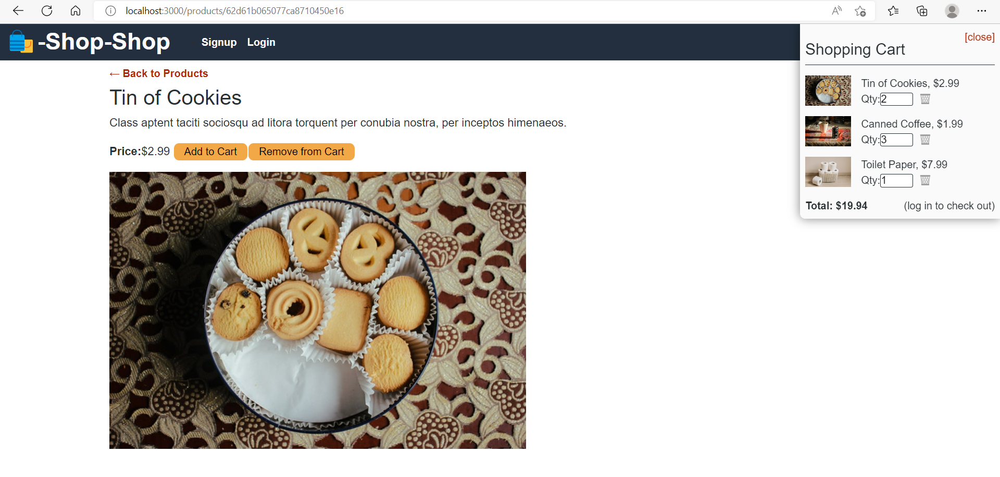

# ecommerce_redux

## Table of Contents

- [Description](#description)
- [User Story](#user-story)
- [Acceptance Criteria](#acceptance-criteria)
- [Installation](#installation)
- [Usage](#usage)
- [Image](#image)
- [Repository](#repository)
- [Production](#production)
- [Contributing](#contributing)
- [Questions](#questions)

## Description

 This is an eCommerce app which will allow user to signup and login to the app.Logged in user can buy items and can checkout the cart. 

## User Story


```md
AS a senior engineer working on an e-commerce platform
I WANT my platform to use Redux to manage global state instead of the Context API
SO THAT my website's state management is taken out of the React ecosystem
```

## Acceptance Criteria

```md
GIVEN an e-commerce platform that uses Redux to manage global state
WHEN I review the app’s store
THEN I find that the app uses a Redux store instead of the Context API
WHEN I review the way the React front end accesses the store
THEN I find that the app uses a Redux provider
WHEN I review the way the app determines changes to its global state
THEN I find that the app passes reducers to a Redux store instead of using the Context API
WHEN I review the way the app extracts state data from the store
THEN I find that the app uses Redux instead of the Context API
WHEN I review the way the app dispatches actions
THEN I find that the app uses Redux instead of the Context API
```

## Installation

`npm init`

`npm i`

`npm run install`

`npm run seed`


## Usage

Run the following command at th root of your project and check the app

`npm run develop`


## Contributing

[Vinitha Gowtheepan](https://github.com/sreevinithaa)

## Image





## Repository

You can get the code in the following link. https://github.com/sreevinithaa/ecommerce_redux.git

## Production

You can check the app in following link. https://shopnshop.herokuapp.com/


## Questions

Contact me with any questions: [email](mailto:sreevinithaa@gmail.com) , [GitHub](https://github.com/sreevinithaa)<br />


